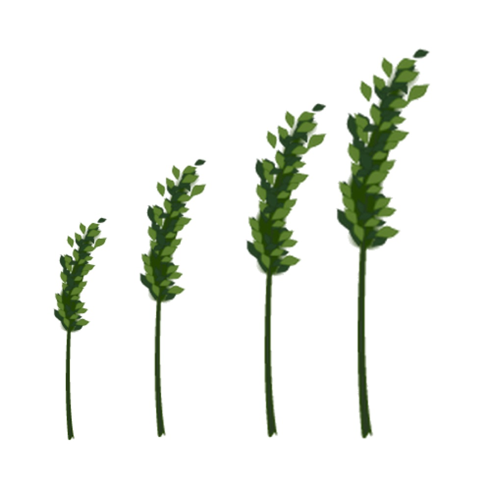

# portfolio

### Released apps

- [APNAssistant(APNアシスタント)](https://github.com/WataruSuzuki/APNAssistant)  
      
    
- [DataUsageCat(パケ代ニャンコ)](https://github.com/WataruSuzuki/DataUsageCat)  
      
    
